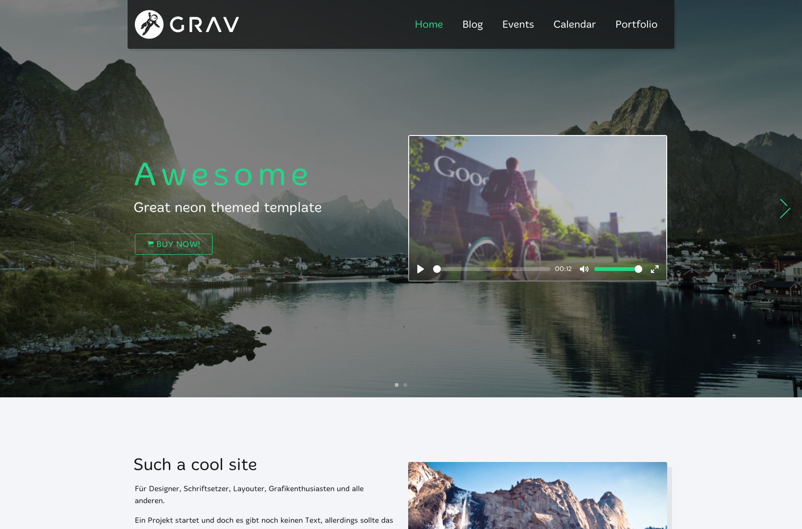

# Flaten Theme for Grav

Flaten is a powerful and big theme that allows you to have many options and modules for creating your personal website. Eather for business or personal use, with the Admin plugin is it as easy to use as similar wordpress themes. Just create a new site and place modules in there, customize it and publish it.

# Features

-   Mobile-first, Responsive Layout
-   Customizable options through admin interface or manually
-   MultiLanguage support
-   Archives plugin support
-   Search plugin support
-   RelatedPages plugin support
-   TaxonomyList plugin support
-   Feeds

## Basic Setup for a new Grav site

The simplest way to install Flaten theme for Grav is to download and install the Flaten Theme package:

1.  [Download Flaten Theme](https://github.com/muuvmuuv/grav-theme-flaten/archive/master.zip)
2.  Simply unzip the package into your GRAVs theme folder.
3.  Use the command `gulp && bower install` in the themes directory to create the distribution content\*
4.  Change the theme in your GRAVs config, job done!

**TIP:** Check out the [general Grav installation instructions](http://learn.getgrav.org/basics/installation) for more details on this process.

> You will need to have gulp and bower installed. [GULP](https://github.com/gulpjs/gulp/blob/master/docs/getting-started.md) [BOWER](https://bower.io/#install-bower)

* * *

## Future things

As this is a side project of mine. I want to give the community a massive Theme to play with and also to help newbies getting faster in frontend development. Until there is no Store for GRAV this theme will be free.
